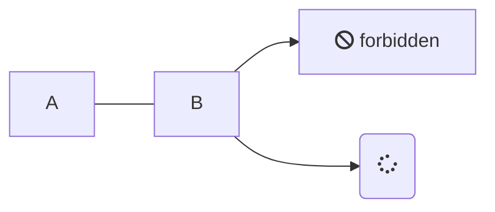

# this is the index of test

$$
\begin{align}
    y = \sin(x) \\
    y = \cos(x) \\
\end{align} \tag{1}
$$

```python
import numpy as np
np.array([1,2,3])
```


```julia
#!/home/zpp/julia-1.9.3/bin/julia
include("./myf.jl")

N = 1000
lnn = 10^6
m_all = Matrix{Float64}(undef, 10^3, N);
lambda_all = Matrix{Float64}(undef, 10^3, N);


while Dates.now() < DateTime(2023, 11, 14, 17, 30, 59)
    si_all = generate_si_all(N; length=20, lnn = 10^6);
    Threads.@threads for j in 1:10^3
        m = ones(N)
        lambda = rand(N)
        shuffle!(si_all)
        Threads.@inbounds for i in 1:lnn
            update!(m; lambda=lambda, si = si_all[i])
        end
        # println("$(maximum(m))" * " by thread $(Threads.threadid())")
        m_all[j,:] = m
        lambda_all[j, :] = lambda
    end

    path_m = "./data/m/"
    path_lambda = "./data/lambda/"
    filename = string(Dates.now()) * ".csv"
    CSV.write(path_m*filename, DataFrame(m_all,:auto), header=false)
    CSV.write(path_lambda*filename, DataFrame(lambda_all,:auto), header=false)

    println("Finish at $(Dates.now())!")
end
```


